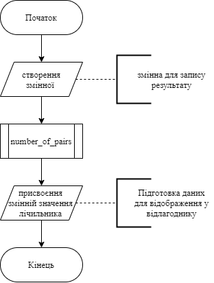
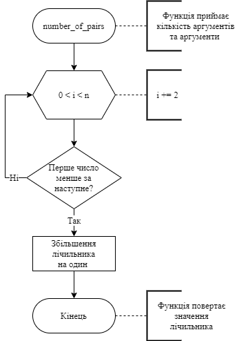
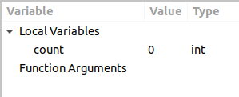
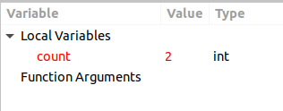
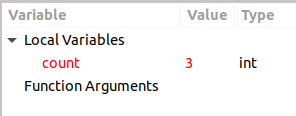

# Лабораторна робота №7. Функції
## Вимоги:
 * *Розробник*: Гуджуманюк Ксенія Сергіївна
 *  *Загальне завдання*: реалізувати програму за допомогою функції.
 *  *Індивідуальне завдання*: реалізувати функцію, що визначає, скільки серед заданої послідовності чисел таких пар, у котрих перше число менше наступного, використовуючи функцію з варіативною кількістю аргументів.
 ## Опис програми:
 * *Функціональне призначення*: програма призначена для визначення кількості пар чисел, у яких перше число менше за наступне.
 *  *Опис логічної структури*: 
       * Функція `main()`. Викликає функцію `number_of_pairs()` та передає в неї кількість елементів й самі аргументи.
       
       * Функція `number_of_pairs()`. Шукає пари таких чисел, щоб перше було менше за наступне. Якщо знаходиться така пара, то значення лічильника збільшується на один. 

       
        
        
 *  *Структура програми*:
```
  .
├── doc
│   ├── assets
│   │   ├── func_for_pairs.png
│   │   ├── main_func.png
│   │   ├── screen1.png
│   │   ├── screen2.png
│   │   └── screen3.png
│   └── lab07.md
├── Doxyfile
├── Makefile
└── src
    ├── task1-5.c
    ├── task1-6.c
    ├── task1.c
    ├── task2-5.c
    ├── task2-6.c
    ├── task3-5.c
    ├── task3-6.c
    ├── task4-5.c
    ├── task4-6.c
    ├── task5-5.c
    ├── task5-6.c
    └── task6-6.c
```

 *  *Важливі елементи програми*:
	 * Виклик функції `number_of_pairs`, де перша цифра відповідає за кількість аргументів, а всі інші ці аргументи
	 ```
	count = number_of_pairs(10, 17, 21, 45, 35, 56, 78, 45, 34, 56, 56);
	 ```
	  * Порівняння кожних двох аргументів. Якщо перший менший за другий, то лічильник `c` збільшуємо на один.
```		
	for(int i = 0; i < n; i += 2){
		int ch1 = va_arg(argument, int);
		int ch2 = va_arg(argument, int);
		if(ch1 < ch2){
			c++;
		} else  continue;
	}
```
 ## Варіанти використання:
  Точка зупинки на строці виклику функції. 
  Аргументи функції: 17, 21, 45, 35, 56, 78, 45, 34, 56, 56.
  
  

Точка зупинки на строці `return 0;`
 
 
  
  Аргументи функції: 17, 69, 40, 20, 50, 51, 86, 87, 20, 14.
  Точка зупинки на строці виклику функції.
  
  
  
  Точка зупинки на строці `return 0;` 
  
  


 ## Висновок:
 у ході лабораторної роботи було створено функцію із варіативною кількістю аргументів.
 
