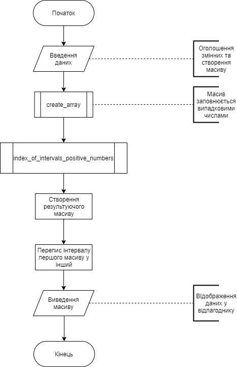
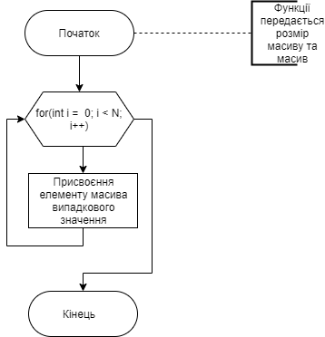
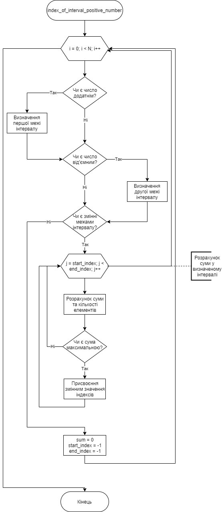
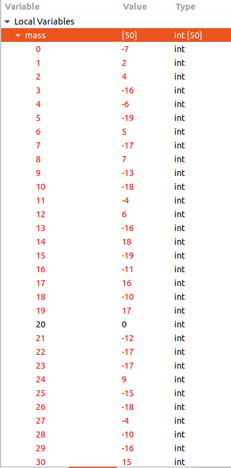
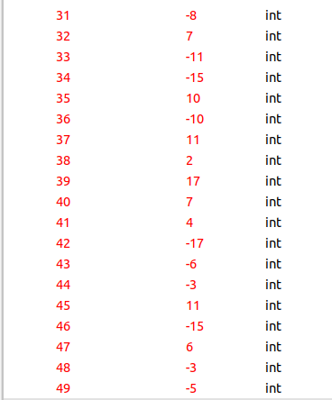
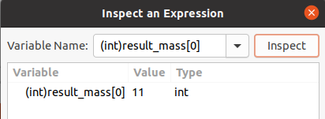
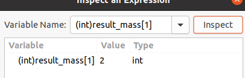
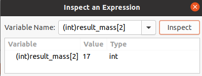
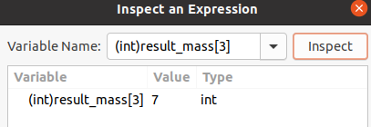

# Лабораторна робота №11
## Вимоги:
* *Розробник*: Гуджуманюк Ксенія

* *Загальне завдання*: реалізувати програму за допомогою показників.

* *Індивідуальне завдання*: Дано масив з N цілих чисел. Знайти безперервну послідовність додатніх чисел у вхідному масиві, сума елементів якої максимальна, та переписати їх у вихідний масив.

## Опис програми:
* *Функціональне призначення*: знаходження безперервної послідовності додатніх чисел, сума яких максимальна. Перепис цих чисел здійснюється за допомогою визначених меж інтервалу, в якому вони знаходяться.

* *Опис логічної структури*: 

* * Функція `main()`. Виклик функції `create_arr()`. Виклик функції `index_of_interval_positive_nambers()`.

 

 * * Функція `create_array()`. Заповнює масив випадковими числами у заданому діапазоні.

 

 * * Функція `index_of_interval_positive_nambers()`. Тут здійснюється перевірка, чи є число додатнім. Якщо виконується ця умова та умова, яка передбачає, що це перше додатнє число, тоді визначається початкова межа інтервалу. Якщо число є від'ємним та визначена початкова межа, то індекс мінус один цього числа є другою межею інтервалу. Також рахується сума всіх елементів отриманого відрізку. Якщо сума є максимальною, тоді інтервал відповідних елементів переписується до іншого масиву.



* *Структура програми*: 
```
.
├── doc
│   ├── assets
│   │   └── l11.png
│   └── Doc11.md
├── Doxyfile
├── Makefile
└── src
    ├── task1.c
    ├── task2.c
    ├── task3.c
    └── task4.c

```
* *Важливі елементи програми*:

* * Знаходження індексів:

```
for (int i = 0; i < N; i++) {
        if(*(mass + i) >= 0 && start_index == -1){
            start_index = i;
        } 
        else if(*(mass + i) < 0 && start_index != -1){
            end_index = i - 1;
        }
```
* * Підрахунок суми:

```
if(start_index != -1 && end_index != -1){
            for(int j = start_index; j <= end_index; j++) {
                sum += *(mass + j);
```
* * Визначення максимальної суми та запам'ятовування поточних індексів

```
if(sum > sum_max){
                sum_max = sum;
                start_index_max = start_index;
                end_index_max = end_index;
                size_of_result_mass = count;
                }
```

## Варіанти використання програми

При вхідних даних:





Отримаємо такі вихідні дані:







 


## Висновок

у ході роботи було створено програму за допомогою показників.

