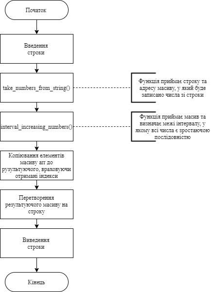
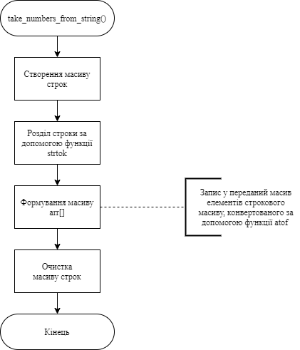
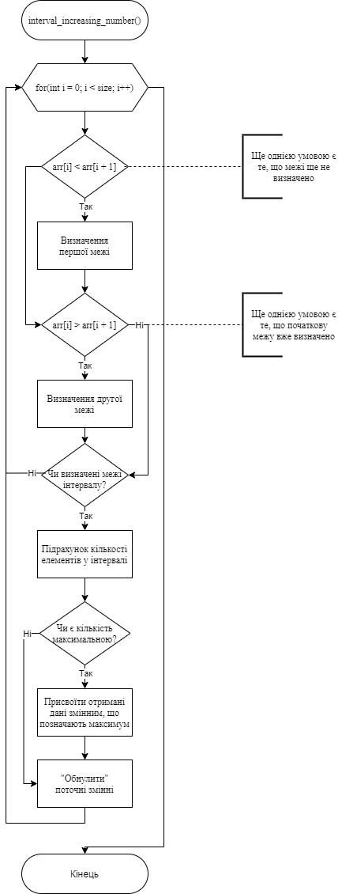
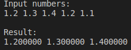
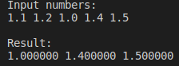

# Лабораторна робота №12
## Вимоги:
* *Розробник*: Гуджуманюк Ксенія

* *Загальне завдання*: Переробити програму на вибір. Продемонструвати взаємодію з користувачем шляхом використання функцій gets(), puts().

* *Індивідуальне завдання*:  Змінити програму з попередньої роботи так, щоб: 
* * початкові дані вводилися з клавіатури;
* * видача результуючих даних провадилася у консоль
* * при старті програми виводилася інформація про автора, номер та тему лабораторної роботи
* * при запиті даних користувач отримав повідомлення, що від нього очікують. 

## Опис програми:
* *Функціональне призначення*: Знаходження інтервалу, у якому елементи - це безперервна зростаюча послідовність чисел.

* *Опис логічної структури*: 

* * Функція `main()`: Введення даних через консоль. Виклик функції `take_numbers_from_string()`. Виклик функції `interval_increasing_numbers()`. Копіює елементи початкового масиву, котрі знаходяться в межах отриманого інтервалу, у результуючий масив. Виведення результуючих даних.



* * Функція `take_numbers_from_string()`: Бере числа зі строки та конвертує їх у тип float.



* * Функція `interval_increasing_numbers()`: Знаходить межі інтервалу.



* *Структура програми*:

```
.
├── doc
│   ├── assets
│   └── lab12.md
├── Doxyfile
├── Makefile
└── src
    ├── lib.c
    ├── lib.h
    ├── task1.c
    ├── task2.c
    ├── task3.c
    └── task4.c

```
* *Важливі елементи програми*:

* * Введення строки:
```
char string[255];
puts("Input numbers: ");
gets(&string);

```
* * Перетворення строки string в масив чисел arr[] типу float:
```
char* tmp = strtok(string, " "); 
    char ** array_str = malloc(N2 * sizeof(char*));
    for(int i = 0; i < N2; i++) {
       array_str[i] = malloc(25 * sizeof(char));
    }
    while (tmp) {
        strcpy(array_str[n], tmp);
        tmp = strtok(NULL, " ");
        n++;
    }

    for(int i = 0; i < N2; i++) {
        arr[i] = atof(array_str[i]);
    }
```
* * Перетворення результуючого масиву на строку:
```
for(int i = 0; i <= max_count; i++) {
        sprintf(temp, "%f", result_arr[i]);
        strcat(str, temp);
        strcat(str, " ");
    }
```
* * Виведення строки:
```
puts(str);
```
## Варіанти використання програми





## Висновок
Перероблено програму №2. Продемонструвано взаємодію з користувачем шляхом використання функцій gets(), puts().
