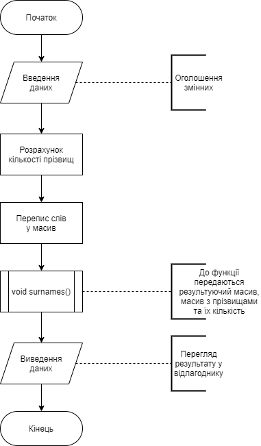
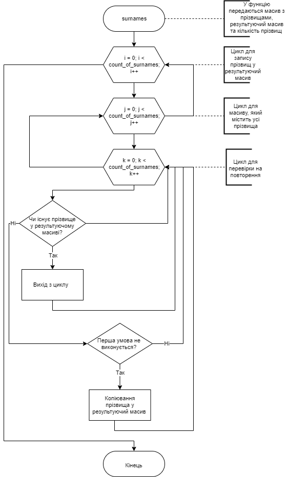
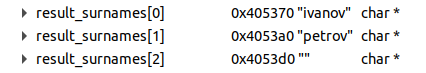

# Лабораторна робота №13
## Вимоги:
* *Розробник*: Гуджуманюк Ксенія

* *Загальне завдання*: реалізувати програму зі строками.

* *Індивідуальне завдання*: Текст - це перелік прізвищ студентів через кому. Видалити з тексту усі дублікати.

## Опис програми:
* *Функціональне призначення*: Програма переписує з одного масиву до іншого призвища без дублікатів.

* *Опис логічної структури*:

* * Функція main()



* * Функція surname()



* *Структура програми*:

```
.
├── doc
│   ├── assets
│   │   ├── first.png
│   │   ├── ivanov2.png
│   │   ├── ivanov.png
│   │   └── petrov.png
│   └── lab13.md
├── Doxyfile
├── Makefile
└── src
    ├── lib.c
    ├── lib.h
    ├── task1.c
    ├── task2.c
    ├── task3.c
    └── task4.c

```


* *Важливі елементи програми*:

* * Перепис слів із рядка у масив:

    ```
    while(part1) {
       strcpy(array_of_surnames[i], part1);
       part1 = strtok(NULL, " ,.");
       i++;
   }

    ```
* * Перепис прізвищ у результуючий масив без повторень:

    ```

    for(int i = 0; i < count_of_surnames; i++) {
        for(int j = i; j < count_of_surnames; j++) {
            for(int k = 0; k < count_of_surnames; k++) {
                if(strcmp(result_surnames[k], array_of_surnames[j]) == 0) {
                    break;
                }
            
                else if(strcmp(result_surnames[k], array_of_surnames[j]) != 0) {
                    strcpy(result_surnames[i], array_of_surnames[j]);
                    
                }
            }
        }
    }
    ```

## Варіанти використання програми

При вхідних даних: ivanov,petrov,ivanov

Отримаємо результат:




## Висновок

у ході роботи було реалізовано програму зі строками.