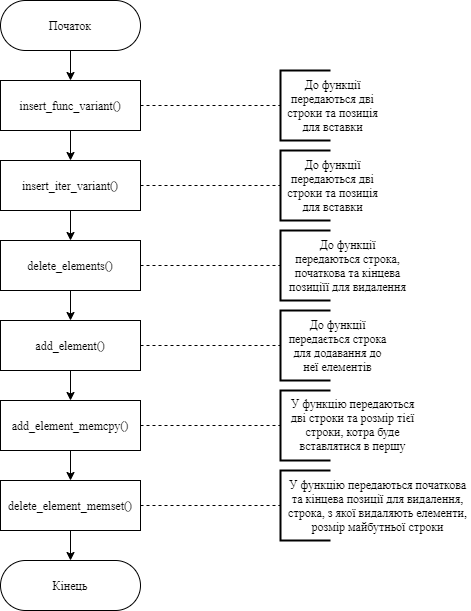
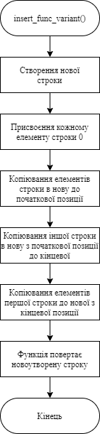
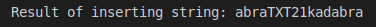
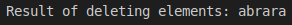

# Лабораторна робота №12
## Вимоги:
* *Розробник*: Гуджуманюк Ксенія

* *Загальне завдання*: 
* * розробити в функцію, яка реалізує вставку одного рядка в інший; 
* * Розробити функцію видалення одного рядка з іншого; 
* * За допомогою функцій memcpy, memset створити функції додання та видалення елементів з динамічного масиву.


## Опис програми:
* *Функціональне призначення*: програма створена для реалізації додавання/видалення елементу/рядка з динамічного масиву.

* *Опис логічної структури*: 

* * Функція `main()`: викликає функції `insert_func_variant`, `insert_iter_variant`, `add_element_memcpy`, `delete_elements`, `add_element`, `delete_element_memset`.



* * Функція `insert_func_variant`: 



* * Функція `insert_iter_variant`: 
* * Функція `add_element_memcpy`:
* * Функція `delete_elements`:
* * Функція `add_element`:
* * Функція `delete_element_memset`:


* *Структура програми*:
```
.
├── dist
│   ├── main.bin
│   └── test.bin
├── doc
│   ├── assets
│   └── lab18.md
├── Doxyfile
├── Makefile
├── src
│   ├── lib.c
│   ├── lib.h
│   └── main.c
└── test
    └── test.c

```


* *Важливі елементи програми*:
* * Вставка одного рядка в другий за допомогою строкових функцій: 
```
char* result2 = (char*)malloc(size * sizeof(char));
	for (unsigned long i = 0; i < size; i++) {
		result2[i] = 0;
	}
	strncpy(result2, string1, 4);
	strncpy(result2 + 4, string2, strlen(string2));
	strncpy(result2 + 4 + strlen(string2), string1 + 4, 7);
	printf("Result of inserting string: ");
	puts(result2);
    return result2;

```
* * Видалення одного рядка з іншого:
```
char* result_delete = (char*)malloc((strlen(original) - 5 + 1) * sizeof(char));
	strncpy(result_delete, original, (unsigned long) pos_start);
	strncpy(result_delete + pos_start, original + pos_end + 1, 3);
```

* * Додавання елементу за допомогою функції `memcpy`:
```
int posit_add_start = 4;
	int posit_add_end = 0;

	posit_add_end = posit_add_start + num_of_add_el;
	int adding_space = num_of_add_el;

	int size1 = (int)strlen(sentence) + adding_space + 1;

	char* res = (char*)malloc((unsigned long)size1 * sizeof(char));
	for (int i = 0; i < size1; i++) {
		res[i] = 0;
	}
	memcpy(res, sentence, (unsigned long) posit_add_start);
	memcpy(res + posit_add_start, tmp, strlen(tmp) + 1);
	memcpy(res + adding_space + posit_add_start, sentence + posit_add_start, strlen(sentence) - (unsigned long) posit_add_start);
	printf("Result memcpy: ");
	printf("%s\n", res);
    return res;

```
* * Видалення елементу за допомогою функції `memset`:
```
char* result_delete_memset = (char*)malloc((unsigned long)size_del * sizeof(char));
	for (int i = 0; i < size_del; i++) {
		result_delete_memset[i] = 0;
	}
	int j = 0;
	for (int i = 0; i <= (int) size_sentence; i++) {
		if (i > pos_del_start && i < pos_del_end) {
			continue;
		}
		else {
			memset(result_delete_memset + j, sentence[i], 1);
			j++;
		}
	}
```

## Варіанти використання програми
* * Вставка рядка "TXT21" в рядок "abrakadabra" на 4 позицію



* * Видалення елементів з рядка "abrakabra", починаючи з 4 позиції



* * Додавання елементів "Cv" в кінець рядка "trylala"


* * Вставка рядка "hello" в рядок "have a nice day" за допомогою функції `memcpy`


* * Видалення двох елементів з рядка "have a nice day" за допомогою функції `memset`


## Висновок
