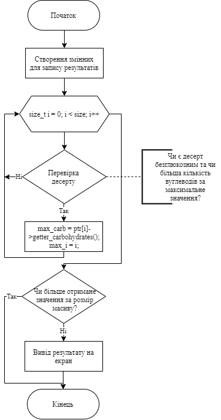
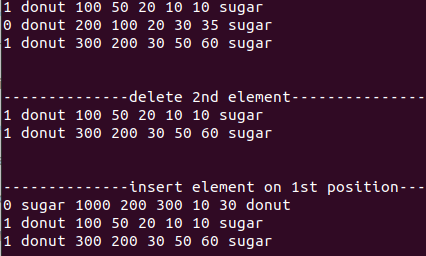

# Лабораторна робота №23
## Вимоги:
* *Розробник*: Гуджуманюк Ксенія Сергіївна
* *Перевірив*: Давидов Вячеслав Вадимович
* *Загальне завдання*: Для предметної галузі з розділу "Розрахункове завдання / Індивідуальні завдання" розробити два класи: - клас, що відображає сутність "базового класу", у тому числі: - конструктор за замовчуванням, копіювання та конструктор з аргументами (реалізація конструкторів повинна бути продемонстрована за допомогою списків ініціалізації); - деструктор - клас, що має у собі динамічний масив об'єктів базового класу та має в собі методи додавання, видалення елемента, отримання елемента по індексу (або ідентифікатору), вивід усіх елементів на екран. Рекомендовані сигнатури методів: - додавання, видалення, отримання по індексу, виведення усіх єлементів, метод 1 обходу колекції.
* *Індивідуальне завдання*: Обрати прикладну галузь за варіантом відповідно до номера у журналі групи.
## Опис програми:
* *Функціональне призначення*: додавання, видалення, отримання за індексом десертів у класі-списку.
* *Опис логічної структури*: 
    * Функція `main()` - створює масив та викликає методи роботи з ним.
    * Функція `delete_el(size_t pos)` - видаляє елемент за вказаною позицією.
    * Функція `showarray()` - виводить масив на екран.
    * Функція `search_by_notGlucose_maxCarb()` - шукає безглюкозний десерт з найбільшим вмістом вуглеводів.

	

    * Функція `add_el` - додає новий десерт до масиву за вказаною позицією.
    * Функція `search_by_index(size_t index)` - отримання елементу за індексом.
* *Структура прорами*:
```
.
├── dist
│   ├── main.bin
│   └── test.bin
├── Makefile
├── src
│   ├── class_array.cpp
│   ├── class_array.h
│   ├── class_data.cpp
│   ├── class_data.h
│   └── main.cpp
└── test
    └── test.cpp
```
* *Важливі елементи програми*:
    * Клас-десерт:
    ```c++
    class Dessert{
    private:
	    bool IsGlucose;
	    char NameDessert[20];
	    double Weight;
	    NutritValue Nutrit;
	    char Taste[20];
    public:
	    Dessert();
	    void setter(bool glucose, char name[], double weight, double nkkal, double nproteins, double nfats, double ncarb, char taste[]);
	    void show();
	    ~Dessert();
	    double getter_weight();
	    double getter_carbohydrates();
	    bool getter_isglucose();
	    char* getter_taste();
	    Dessert(const Dessert& copy);
	    bool operator != (const Dessert& right);
    };
    ```

    * Клас-масив:
    ```c++
    class Array_Desserts {
    private:
	    Dessert** ptr;
	    size_t size;
    public:
	    Array_Desserts();
	    Array_Desserts(size_t size_arr);
	    void setarray(int index, bool glucose, char name[], double weight, double nkkal, double nproteins, double nfats, double ncarb, char taste[]);
	    void showarray();
	    ~Array_Desserts();
	    void delete_el(size_t index);
	    void add_el(size_t index, Dessert* smth);
	    void searching_by_min_weight_and_taste();
	    void search_by_index(size_t index);
	    void set_information_to_array();
	    Array_Desserts(const Array_Desserts& arrayToCopy);
	    bool operator == (const Array_Desserts& right);
	    void search_by_notGlucose_maxCarb();
	    Dessert* search_by_notGlucose_maxCarb_for_test();
    };
    ```

## Варіанти використання програми:



## Висновок
Розроблено два класи: перший відображає сутність "базового класу", другий - клас, що має у собі динамічний масив об'єктів базового класу.