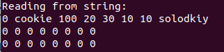
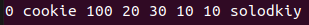

# Лабораторна робота №24
## Вимоги:
* *Розробник*: Гуджуманюк Ксенія Сергіївна
* *Перевірив*: Давидов Вячеслав Вадимович
* *Загальне завдання*: Поширити попередню лабораторну роботу таким чином:
    * використання функцій printf/scanf замінити на використання cin/cout;
    * усі конкатенації рядків замінити на використання stringstream;
    * замінити метод виводу інформації про об’єкт на метод, що повергає рядок- інформацію про об’єкт який далі можна виводити на екран;
    * замінити метод вводу інформації про об’єкт на метод, що приймає рядок з інформацією про об’єкт, обробляє його та створює об’єкт на базі цієї інформації;
    * поширити клас-список, шляхом реалізації методів роботи з файлами за допомогою файлових потоків (fstream) (якщо використовувалися функції fprintf/fscanf - замінити їх на класи ifstcam/ofstream), при цьому сигнатури методів повинні виглядати таким чином:
        * читання (List - клас-список об’єктів, при цьому слід пам’ятати, що при повторному читанні з файлу, попередні дані списку повинні бути очищені):
        * запис.

## Опис програми:
* *Структура прорами*:

```
.
├── AllDesserts_empty.txt
├── AllDesserts.txt
├── doc
│   └── lab24.md
├── Makefile
├── src
│   ├── class_array.cpp
│   ├── class_array.h
│   ├── class_data.cpp
│   ├── class_data.h
│   └── main.cpp
└── test
    └── test.cpp
```

* *Важливі елементи програми*:
Запис десерту у рядок:
```c++
   std::string to_string() {
		std::ostringstream ostr;
		ostr << IsGlucose << ' ' << NameDessert << ' ' << Weight << ' ' << Nutrit.Kkal << ' ' << Nutrit.Proteins << ' ' << Nutrit.Fats << ' ' << Nutrit.Carbohydrates << ' ' << Taste;
		std::string string_obj = ostr.str();
		std::cout << string_obj << std::endl;
		return string_obj;
	}
```

Читання десерту з рядка:
```c++
void from_string(std::string smth) {
		std::istringstream istr(smth);
		bool glucose;
		char name[20];
		double weight, kkal, prot, fat, carb;
		char taste[20];
		istr >> glucose >> name >> weight >> kkal >> prot >> fat >> carb >> taste;
		setter(glucose, name, weight, kkal, prot, fat, carb, taste);
	}
```
## Варіанти використання програми:

Читання даних зі строки до елементу масиву:

Строка: "0 cookie 100 20 30 10 10 solodkiy".



Запис нульового елементу масиву до строки та вивід її на екран:




## Висновок
Поширено попередню лабораторну роботу відповідно до завдання.