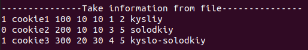
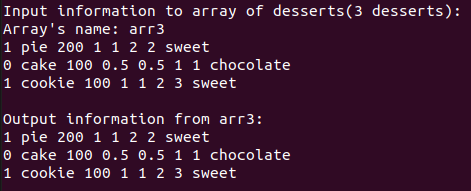

# Лабораторна робота №25
## Вимоги:
* *Розробник*: Гуджуманюк Ксенія Сергіївна
* *Перевірив*: Давидов Вячеслав Вадимович
* *Загальне завдання*: Поширити попередню лабораторну роботу таким чином:
    * у базовому класі, та класі/класах-спадкоємцях перевантажити:
    * оператор присвоювання;
    * оператор порівняння (на вибір: =,<,>,>=,<=,!=);
    * оператор введення / виведення;
    * у класі-списку перевантажити:
    * оператор індексування ([ ]);
    * введення / виведення з акцентом роботи, у тому числі і з файлами. При цьому продовжувати використовувати регулярні вирази для валідації введених даних.

## Опис програми:
* *Функціональне призначення*: додавання, видалення, отримання за індексом десертів у класі-списку.
  
* *Структура прорами*:

```
.
├── doc
│   ├── 25.md
│   └── picture
├── Makefile
├── src
│   ├── class_array.cpp
│   ├── class_array.h
│   ├── class_data.cpp
│   ├── class_data.h
│   └── main.cpp
└── test
    └── test.cpp
```

* *Важливі елементи програми*:

Перевантажений оператор порвняння:
```c++
bool operator==(const Dessert& d1, const Dessert& d2)
{

	return (d1.IsGlucose == d2.IsGlucose &&
		d1.NameDessert == d2.NameDessert &&
		d1.Weight == d2.Weight &&
		d1.Nutrit.Kkal == d2.Nutrit.Kkal &&
		d1.Nutrit.Proteins == d2.Nutrit.Proteins &&
		d1.Nutrit.Fats == d2.Nutrit.Fats &&
		d1.Nutrit.Carbohydrates == d2.Nutrit.Carbohydrates &&
		d1.Taste == d2.Taste);
}
```

Перевантажений оператор індексування:
```c++
Dessert*& Array_Desserts::operator[](size_t index)
{
	return ptr[index];
}
```
   
## Варіанти використання програми:

Читання файлу за допомогою перевантаженогo опператора `<=`:



Використання перевантажених операторів введення/виведення:



## Висновок
Поширено попередню лабораторну роботу шляхом перевантаження операторів присвоювання, порівняння, введення/виведення
