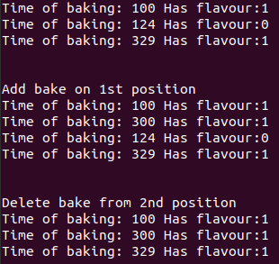

# Лабораторна робота №26
## Вимоги:
* *Розробник*: Гуджуманюк Ксенія Сергіївна
* *Перевірив*: Давидов Вячеслав Вадимович
* *Загальне завдання*: Модернізувати попередню лабораторну роботу шляхом:
    * додавання класів-спадкоємців з розділу "Розрахункове завдання / Індивідуальні завдання", котрі будуть поширювати функціонал "базового класу" відповідно до індивідуального завдання.
    * додавання ще класу-списку для кожного класу-спадкоємцю, що буде керувати лише елементами стосовно класу-спадкоємця.
## Опис програми:

* *Структура програми*:

```
.
├── dist
│   └── main.bin
├── doc
│   └── 26.md
├── Makefile
├── src
│   ├── bake_arr.h
│   ├── bake.h
│   ├── class_array.cpp
│   ├── class_array.h
│   ├── class_data.cpp
│   ├── class_data.h
│   ├── jelly_based_dessert_arr.h
│   ├── jelly_based_dessert.h
│   └── main.cpp
└── test
    └── test.cpp
```

* *Важливі елементи програми*:
Клас-спадкоємець "Випічка":

```c++
class bake :public Dessert {
	
private:
	double time_of_baking;
	bool is_flavour;
public:
	bake() {
		time_of_baking = 0;
		is_flavour = false;
	}

	void setterbake(double time, bool isflav)
	{
		time_of_baking = time;
		is_flavour = isflav;
	}

	double TimeOfBaking() {
		return time_of_baking;
	}

	bool IsFlavour() {
		return is_flavour;
	}

	~bake() {

	}
};
```
Клас-масив:

```c++
class Array_Bake
{
private:
	size_t sizemass;
	bake** mass;
public:
	Array_Bake()
	{
		sizemass = 3;
		mass = new bake * [sizemass];
		for (size_t i = 0; i < sizemass; i++)
		{
			mass[i] = new bake;
		}
		for (size_t i = 0; i < sizemass; i++)
		{
			mass[i]->setterbake(0, false);
		}
	}

	Array_Bake(size_t sizet)
	{
		sizemass = sizet;
		mass = new bake * [sizemass];
		for (size_t i = 0; i < sizemass; i++)
		{
			mass[i] = new bake;
		}
		for (size_t i = 0; i < sizemass; i++)
		{
			mass[i]->setterbake(0, false);
		}
	}

	Array_Bake(double time_, bool flavour_)
	{
		sizemass = 1;
		mass = new bake * [sizemass];
		for (size_t i = 0; i < sizemass; i++)
		{
			mass[i] = new bake;
		}
		for (size_t i = 0; i < sizemass; i++)
		{
			mass[i]->setterbake(time_, flavour_);
		}
	}

	~Array_Bake()
	{

		for (size_t i = 0; i < sizemass; i++)
		{
			delete mass[i];
		}
		delete[] mass;
	}

	void setbake()
	{
		double arr_time[3] = { 100, 124, 329 };
		bool arr_flavour[3] = { true, false, true };
		for (size_t i = 0; i < sizemass; i++)
		{
			mass[i]->setterbake(arr_time[i], arr_flavour[i]);
		}
	}

	void print_bake()
	{
		for (size_t i = 0; i < sizemass; i++)
		{
			std::cout << "Time of baking: " << mass[i]->TimeOfBaking() << " Has flavour:" << mass[i]->IsFlavour() << std::endl;
		}
	}

	void delete_bake(size_t index) {
		if (this->sizemass == 0) return;
		bake * *new_array = new bake * [sizemass - 1];
		if (index >= sizemass) index = this->sizemass - 1;
		memcpy(new_array, this->mass, index * sizeof(Dessert*));
		memcpy(new_array + index, this->mass + index + 1, (this->sizemass - index - 1) * sizeof(Dessert*));
		delete mass[index];
		delete[] this->mass;
		this->mass = new_array;
		this->sizemass--;
	}


	void add_bake(size_t index, bake * smth) {
		bake** new_Dessert = new bake * [sizemass + 1];
		int n = 0;
		for (size_t i = 0; i < sizemass + 1; i++) {
			new_Dessert[i] = this->mass[n];
			if (i == index) {
				new_Dessert[i] = smth;
				n--;
			}
			n++;
		}
		delete[] this->mass;
		this->mass = new_Dessert;
		this->sizemass++;
	}

};
```
   
## Варіанти використання програми:



## Висновок
Модернізовано попередню лабораторну роботу шляхом додавання двох класів-спадкоємців та класів-списків до кожного з них.
