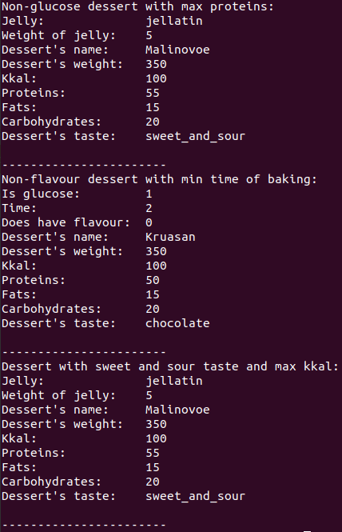

# Лабораторна робота №27
## Вимоги:
* *Розробник*: Гуджуманюк Ксенія Сергіївна
* *Перевірив*: Давидов Вячеслав Вадимович
* *Загальне завдання*: Модернізувати попередню лабораторну роботу шляхом:
    * базовий клас зробити абстрактним. Додати абстрактні методи;
    * розроблені класи-списки поєднуються до одного класу таким чином, щоб він міг працювати як з базовим класом, так і з його спадкоємцями. При цьому серед полів класу-списку повинен бути лише один масив, що містить усі типи класів ієрархії. Оновити методи, що працюють з цим масивом.
    * у функціях базового класу та класів-спадкоємців обов’язкове використання ключових слів final та override.

## Опис програми:
* *Функціональне призначення*: обробка списку десертів.

* *Структура програми*:

```
.
├── doc
│   └── 27.md
├── Makefile
├── src
│   ├── desserts_arr.cpp
│   ├── desserts_arr.h
│   ├── desserts.cpp
│   ├── desserts.h
│   └── main.cpp
└── test
    └── test.cpp
```

* *Важливі елементи програми*:
Базовий клас:
```c++
class Dessert {
public:
	virtual void Print() = 0;
	virtual Dessert* clone() = 0;
	virtual ~Dessert() {}
	virtual double Weight_of_Carbohydrates_in_NoGlucose_Desserts() = 0;
	virtual double IsItSweetSour() = 0;
	virtual double Bake_IsItFlour() = 0;
};
```
   
## Варіанти використання програми:

Методи роботи з колекцією:



## Висновок
Модернізовано попередню лабораторну роботу відповідно до завдання.