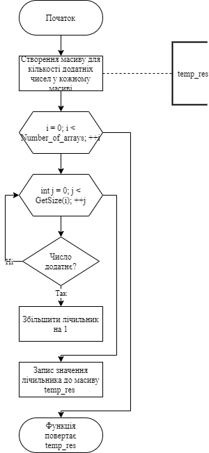
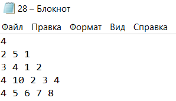
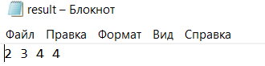

# Лабораторна робота №28
## Вимоги:
* *Розробник*: Гуджуманюк Ксенія Сергіївна
* *Перевірив*: Давидов Вячеслав Вадимович
* *Загальне завдання*: У файлі розміщена інформація про N масивів. У першому рядку міститься інформація про кількість масивів, у кожній наступній - інформація про кількість елементів у кожному масиві та власне дані масиву. Необхідно реалізувати програму, що виконує перераховані нижче дії, причому кожна з них в окремій функції, поки користувач не введе замість назви файлу рядок \exit. Дії, що має виконувати програма, такі:

    * введення з клавіатури назви вхідного файлу з даними;

    * читання даних з файлу;

    * виконання індивідуального завдання;

    * введення з клавіатури імені вихідного файлу;

    * запис результату операції у файл;

    * доступ до елемента за індексом слід винести в окрему функцію, що виконує перевірку на можливість виходу за межі масиву.

* *Індивідуальне завдання*: Визначити кількість додатніх елементів у масиві.

## Опис програми:

* *Функціональне призначення*: можливість підрахунку кількості додатніх чисел у кожному масиві

* *Опис логічної структури*: 
  `main()` - виклик функції `Start()`.

  `Start()` - отримання імені файлу та виклик меню.

  `Menu()` - виведення на екран запиту на вибір функції та отримання інформації про нього.

  `Selected_Function(int choice) ` - виконaння потрібної функції.

  `Find_Positive_Number()` - знаходження кількості додатніх чисел.

  
* *Структура програми*:
```
.
├── dist
│   ├── main.bin
│   └── test.bin
├── doc
│   ├── 28.md
│   └── picture
│       ├── 1.png
│       └── 2.png
├── Makefile
├── result.txt
├── src
│   ├── 28.txt
│   ├── main.cpp
│   ├── menu.cpp
│   ├── menu.h
│   ├── result.txt
│   ├── task.cpp
│   └── task.h
└── test
    └── test.cpp
```

* *Важливі елементи програми*:
Визначення кількості додатніх чисел:
```c++
int* Task::Find_Positive_Number() 
{
	int* temp_res = new int[Number_of_arrays];
	int count = 0;
	ResultSize = Number_of_arrays;
	for (int i = 0; i < Number_of_arrays; ++i) 
	{
		for (int j = 0; j < GetSize(i); ++j) 
		{
			if (GetEl(i, j) >= 0) 
			{
				count++;
			}
		}
		temp_res[i] = count;
		count = 0;
	}
	return temp_res;
}
```
   
## Варіанти використання програми:
Вхідні дані:




Вихідні дані:


## Висновок
Реалізовано програму, що визначає кількість додатніх чисел у кожному масиві.