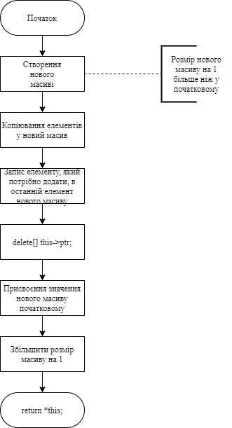
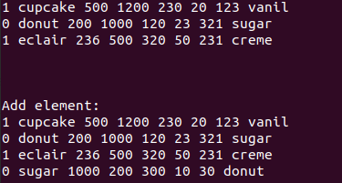

# Лабораторна робота №29
## Вимоги:
* *Розробник*: Гуджуманюк Ксенія Сергіївна
* *Перевірив*: Давидов Вячеслав Вадимович
* *Загальне завдання*:
    * Зробити шаблонний клас-список, що має шаблоноване поле масиву
    * Створити наступні методи:
        * вивід вмісту масиву на екран;
        * визначити індекс переданого елемента в заданому масиві;
        * відсортувати елементи масиву;
        * визначити значення мінімального елемента масиву.
        * додати елемент до кінця масиву
        * видалити елемент з масиву за індексом
* *Додаткове завданий на оцінку "відмінно"*: продемонструвати роботу шаблоннго класу, в масиві якого знаходиться ієрархія класів (тобто не тільки базовий клас, а ще й клас-спадкоємець).


## Опис програми:

* *Функціональне призначення*: можливість обробки масиву за допомогою розроблених методів.

* *Опис логічної структури*: 

`main()` - виклик розроблених методів.

Перевантажений оператор `+=` - додавання елементу до масиву.


  
* *Структура програми*:

```
.
├── doc
│   ├── 29.md
│   └── picture
│       └── 29.png
├── Makefile
├── src
│   ├── bake_arr.h
│   ├── bake.h
│   ├── class_array.cpp
│   ├── class_array.h
│   ├── class_data.cpp
│   ├── class_data.h
│   ├── jelly_based_dessert.h
│   └── main.cpp
└── test
    └── test.cpp
```

* *Важливі елементи програми*:

Шаблонований клас-список, що має шаблоноване поле масиву:

```c++
template <class T>
class Array_Desserts {
	
	friend ostream& operator<< (ostream& output, const Array_Desserts<T>& obj) 
	{
		for (size_t ix = 0; ix < obj.size; ix++)
		{
			output << *obj.ptr[ix];
			output << std::endl;
		}
		output << std::endl; 
		return output; 
	}

private:
	T** ptr;
	size_t size;
public: ...
```

Шаблонований клас-масив спадкоємця:

```c++
template <class B>
class Array_Bake
{
private:
	size_t sizemass;
	B** mass;
public: ...
```
   
## Варіанти використання програми:



## Висновок
Створено шаблонний класс, в масиві якого знаходиться ієрархія класів.
