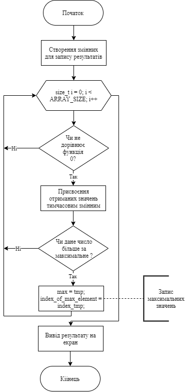
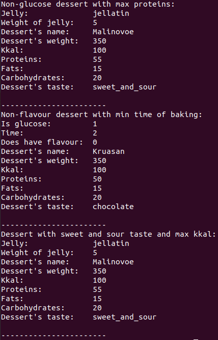

# Лабораторна робота №30
## Вимоги:
* *Розробник*: Гуджуманюк Ксенія Сергіївна
* *Перевірив*: Давидов Вячеслав Вадимович
* *Загальне завдання*: Поширити реалізацію лабораторної роботи “Поліморфірзм” наступним шляхом:
    * замінити масив та CRUD (create/read/update/delete) методи роботи з ним на використання STL
    * для предметної галузі з розділу “Розрахункове завдання / Індивідуальні завдання” реализувати/оновити всі методи роботи з колекцією на використання функцій STL
    * додати функцію сортування коллекції з використанням функтора
    * додати функцію об’єднання двох класів-списків

## Опис програми:
* *Функціональне призначення*: можливість обробки списку десертів шляхом додавання, видалення, сортування, виведення на екран елементів.
* *Опис логічної структури*: 
    * Функція `main()` - створення списку десертів та виклик методів роботи з ним.
    * Функція `sort_arr()` - сортування списку десертів.
    * Функція `combine_arrays(Array_Desserts v1, Array_Desserts v2)` - обєднання двох списків.
    * Функція `Not_Glucose_Max_Carbohydrates()` - пошук безглюкозного десерту з максимальною кількістю вуглеводів.

	

    * Функція `Sweet_Sour_Taste_And_Max_Kkal()` - пошук десерту з кисло-солодким смаком та з максимальною кількістю калорій.
    * Функція `No_Flavour_And_Min_Time_Of_Baking()`- пошук десерту з найменшим часом випікання та без борошна.
   
* *Структура програми*:

* *Важливі елементи програми*:
   Метод 1(пошук безглюклзного десерту з максимальною кількістю вуглеводів):
   ```c++
  void Not_Glucose_Max_Carbohydrates()
	{
			double max = 0;
			size_t index_of_max_element;
			for (size_t i = 0; i < ARRAY_SIZE; i++)
			{
				if (Desserts.at(i)->Weight_of_Carbohydrates_in_NoGlucose_Desserts() != 0)
				{
					double tmp = Desserts.at(i)->Weight_of_Carbohydrates_in_NoGlucose_Desserts();
					size_t index_tmp = i;
					if (max < tmp)
					{
						max = tmp;
						index_of_max_element = index_tmp;
					}
				}
			}
			cout << "Non-glucose dessert with max carbohydrates:" << endl;
			Desserts.at(index_of_max_element)->Print();
	}
    ```
    Метод 2(пошук десерту з кисло-солодким смаком та з максимальною кількістю калорій):
    ```c++
    void Sweet_Sour_Taste_And_Max_Kkal()
	{
			double max = 0;
			size_t index_of_max_element;
			for (size_t i = 0; i < ARRAY_SIZE; i++)
			{
				if (Desserts.at(i)->IsItSweetSour())
				{
					double tmp = Desserts[i]->IsItSweetSour();
					size_t index_tmp = i;
					if (max < tmp)
					{
						max = tmp;
						index_of_max_element = index_tmp;
					}
				}
			}
			cout << "Dessert with sweet and sour taste and max kkal:" << endl;
			Desserts.at(index_of_max_element)->Print();
	}
    ```
    Метод 3(пошук десерту з найменшим часом випікання та без борошна):
    ```c++
    void No_Flavour_And_Min_Time_Of_Baking()
	{
			double min_time = 1000;
			size_t index_of_dessert_with_min_time_of_baking;
			for (size_t i = 0; i < ARRAY_SIZE; i++)
			{
				if (Desserts[i]->Bake_IsItFlour())
				{
					double tmp = Desserts[i]->Bake_IsItFlour();
					size_t index_tmp = i;
					if (min_time > tmp)
					{
						min_time = tmp;
						index_of_dessert_with_min_time_of_baking = index_tmp;
					}
				}
			}
			cout << "Non-flavour dessert with min time of baking:" << endl;
			Desserts[index_of_dessert_with_min_time_of_baking]->Print();
	}
    ```
    Сортування:
    ```c++
    struct compare 
	{
		bool operator()(Dessert* i, Dessert* j)
		{
			return (i->getWeight_() < j->getWeight_());
		}
	}cc;

	void sort_arr()
	{
		sort(Desserts.begin(), Desserts.end(), cc);
	}
    ```
    Функція об’єднання двох класів-списків:
    ```c++
    Array_Desserts combine_arrays(Array_Desserts v1, Array_Desserts v2)
	{
		Array_Desserts res;
		for (size_t i = 0; i < 6; i++)
		{
			Dessert* tmp = v1.GetDessert(i);
			res.Add_(tmp);
		}
		res.Add_(v2.GetDessert(0));
		return res;
	}
    ```

## Варіанти використання програми:
* Методи роботи з колекцією:



## Висновок 
Поширено реалізацію лабораторної роботи "Поліморфізм", замінивши масив на вектор, реалізовано методи роботи з колекцією, додано функцію сортування та об'єднання двох класів-списків.
