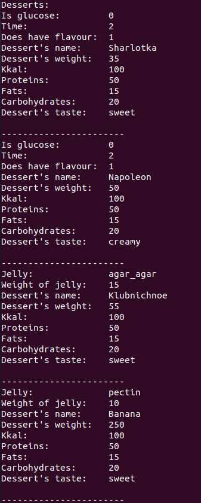
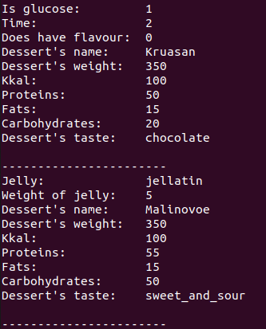

# Лабораторна робота №31
## Вимоги:
* *Розробник*: Гуджуманюк Ксенія Сергіївна
* *Перевірив*: Давидов Вячеслав Вадимович
* *Загальне завдання*: Розширити попередню роботу, зробивши клас-список ітеративним.
## Опис програми:
* *Функціональне призначення*: можливість обробки списку десертів шляхом додавання, видалення, сортування, виведення на екран елементів.
  
* *Структура програми*:

```
.
├── doc
│   ├── 30.md
│   ├── 31.md
│   ├── 32.md
│   └── picture
│       ├── 31_1.png
│       ├── 31_2.png
│       └── 32.png
├── Makefile
└── src
    ├── dessert.cpp
    ├── dessert.h
    ├── desserts_arr.cpp
    ├── desserts_arr.h
    └── main.cpp

```

* *Важливі елементи програми*:
Виведення списку десертів на екран:
```c++
for (Dessert*& dessert : d) 
	{
		dessert->Print();
	}
```
   
## Варіанти використання програми:

Виведення списку на екран:





## Висновок
Продемонстровано ітеративність класу-списку.
