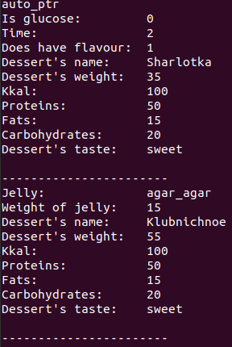

# Лабораторна робота №32
## Вимоги:
* *Розробник*: Гуджуманюк Ксенія Сергіївна
* *Перевірив*: Давидов Вячеслав Вадимович
* *Загальне завдання*: Створити STL-контейнер, що містить у собі об’єкти ієрархії класів, використати розумні вказівники:
    * auto_ptr;
    * unique_ptr;
    * shared_ptr;
    * weak_ptr.
* Додаткове завдання на оцінку “відмінно”: Створити власний розумний вказівник, поданий у вигляді шаблонного класу, який:
    * має перевантажений оператор * та -> для отримання фактичного об’єкта та його вказівника;
    * дозволяє підраховувати кількість вказівників на об’єкт. Продемонструвати дії, коли виникає інкремент та декремент кількості вказівників;
    * контролювати виток пам’яті при виникненні виняткової ситуації.
    * продемонструвати відсутність витоків пам’яті при відсутності явного видалення пам’яті за допомогою функцій delete / free.

## Опис програми:
* *Функціональне призначення*: можливість обробки списку десертів шляхом додавання, видалення, сортування, виведення на екран елементів.

* *Опис логічної структури*: 
`unique_ptr` - це розумний вказівник, який володіє іншим об’єктом і управляє ним за допомогою вказівника.
`auto_ptr` - це розумний вказівник, який управляє об’єктом, отриманим за допомогою нового виразу.
`shared_ptr` - це розумний вказівник, який зберігає спільне право власності на об’єкт через вказівник.
`weak_ptr` - це розумний вказівник, що містить невласне ("слабке") посилання на об'єкт, яким керує `shared_ptr`.

* *Структура програми*:

```
.
├── doc
│   ├── 30.md
│   ├── 31.md
│   ├── 32.md
│   └── picture
│       └── 32.png
├── Makefile
└── src
    ├── dessert.cpp
    ├── dessert.h
    ├── desserts_arr.cpp
    ├── desserts_arr.h
    └── main.cpp
```

* *Важливі елементи програми*:
Створення та заповнення списків десертів

Вказівник `unique_ptr`:
```c++
Array_Desserts<unique_ptr<Dessert>> list_dessert1;
unique_ptr<Dessert> UniqPtrDessert1(new Bake(bake));
unique_ptr<Dessert> UniqPtrDessert2(new Bake(bake2));
list_dessert1.Add_(&UniqPtrDessert1);
list_dessert1.Add_(&UniqPtrDessert2);
```
Вказівник `auto_ptr`:
```c++
auto_ptr<Dessert> AutoPtrDessert1(new Bake(bake));
auto_ptr<Dessert> AutoPtrDessert2(new JellyDessert(jellyDessert));

Array_Desserts<auto_ptr<Dessert>> list_dessert2;
list_dessert2.Add_(&AutoPtrDessert1);
list_dessert2.Add_(&AutoPtrDessert2);
```

Вказівник `shared_ptr`:
```c++
shared_ptr<Dessert> SharedPtrDessert1(new Bake(bake));
shared_ptr<Dessert> SharedPtrDessert2(new JellyDessert(jellyDessert));
Array_Desserts<shared_ptr<Dessert>> list_dessert3;
list_dessert3.Add_(&SharedPtrDessert1);
list_dessert3.Add_(&SharedPtrDessert2);
```

Вказівник `weak_ptr`:
```c++
Array_Desserts<weak_ptr<Dessert>> list_dessert4;
weak_ptr<Dessert> WeakPtrDessert1 = SharedPtrDessert1;
weak_ptr<Dessert> WeakPtrDessert2 = SharedPtrDessert2;
list_dessert4.Add_(&WeakPtrDessert1);
list_dessert4.Add_(&WeakPtrDessert2);
```

   
## Варіанти використання програми:



## Висновок
Створено STL-контейнер, що містить у собі об’єкти ієрархії класів, використано розумні вказівники.